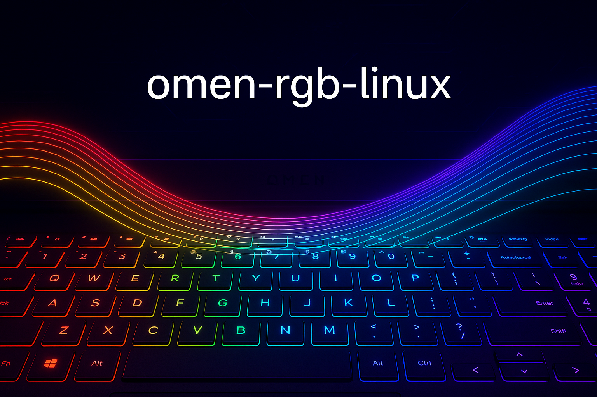
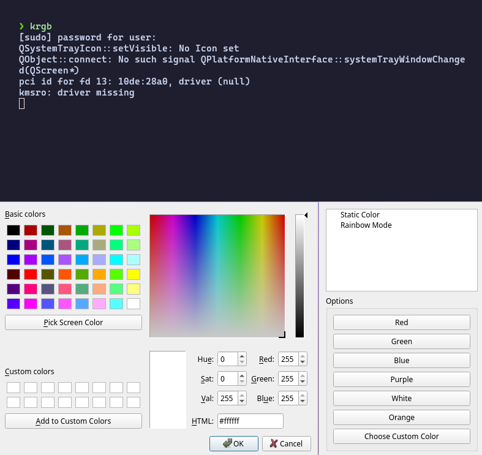

# omen-rgb-linux 🎹✨

RGB keyboard backlight controller for **HP OMEN 17** on Linux.  
Supports static mode with smooth transitions and fast rainbow mode.  
Built with PyQt5, saves your last settings, and runs in the system tray.

---

## 🚀 Features
- Static color with smooth transitions (very fast).
- Rainbow mode with instant animation.
- System tray with simple menu.
- Saves the last used mode (via QSettings).
- HiDPI support.

---

## 🔧 Installation

```bash
git clone https://github.com/YOURNAME/omen-rgb-linux
cd omen-rgb-linux
python3 omen-rgb.py
````

### Dependencies

* Python 3
* PyQt5
* Access to `/sys/devices/platform/hp-wmi/rgb_zones/zone00` (via `udev` rules, without `sudo`)

---

## 🖥️ Usage

1. Run `omen-rgb.py`.
2. A keyboard icon will appear in your system tray.
3. Choose a mode:

   * **Static Color** → presets or custom picker.
   * **Rainbow Mode** → auto-start rainbow animation.



---

## 📂 Code Structure

* `set_color()` — smooth color transitions.
* `RainbowThread` — thread for rainbow animation.
* `RGBController` — GUI with mode tree and options.
* `QSystemTrayIcon` — tray icon and context menu.

---

## ⚠️ Notes

* Do **not** run with `sudo` — set proper access via `udev`.
* Tested on HP OMEN 17, Linux kernel 5.x+.

---

## 📜 License

MIT
